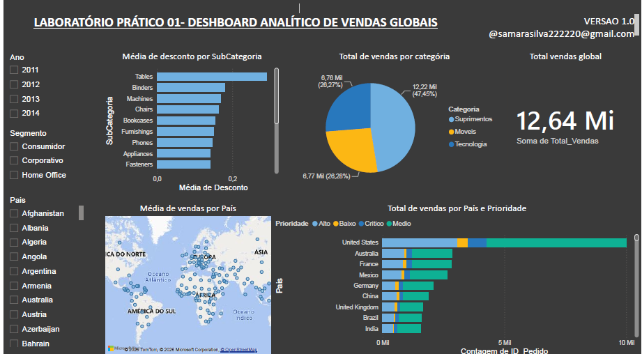

# Dashboard Analítico de Vendas Globais

## 📖 Sobre o projeto

Este projeto foi desenvolvido durante o curso de **Power BI** da **Data Science Academy (DSA)** com o objetivo de praticar a construção de dashboards analíticos e aplicar conceitos de visualização de dados.

O dashboard foi elaborado utilizando uma base de dados **fictícia**, disponibilizada exclusivamente para fins educacionais, simulando vendas realizadas em diferentes países, categorias de produtos e segmentos de clientes.

> **Observação:** A base de dados utilizada pertence ao material do curso e, por esse motivo, não está disponível neste repositório.

---

## 🎯 Objetivo

Desenvolver um dashboard interativo para analisar o desempenho das vendas globais, permitindo identificar padrões, comparar categorias de produtos e explorar indicadores por meio de filtros e visualizações gráficas.

---

## 🛠 Ferramenta utilizada

- Power BI

---

## 📊 Funcionalidades do dashboard

O dashboard permite realizar análises por meio de filtros e gráficos interativos, incluindo:

- Seleção de dados por **ano** (2011 a 2014);
- Filtragem por **segmento de clientes**;
- Filtragem por **país**;
- Visualização da **média de desconto por subcategoria**;
- Distribuição do **total de vendas por categoria de produto**;
- Indicador do **total global de vendas**;
- Mapa com a **média de vendas por país**;
- Comparação do **total de vendas por país e prioridade dos pedidos**.

---

## 📈 Dashboard



---

## 📂 Estrutura do projeto

```text
DASHBOARD-POWERBI/
├── Dashboard/
│   └── lab1.pbix
├── imagens/
│   └── resultado.png
└── README.md
```

---

## ▶ Como visualizar

1. Clone este repositório ou faça o download dos arquivos.
2. Abra o arquivo `lab1.pbix` utilizando o **Power BI Desktop**.
3. Explore os filtros e as visualizações disponíveis no dashboard.

---

## 📌 Observações

- Este projeto possui finalidade exclusivamente educacional.
- Os dados utilizados são fictícios e foram disponibilizados durante o curso da **Data Science Academy (DSA)**.
- O dashboard foi desenvolvido como prática dos conceitos de modelagem, visualização e análise de dados no Power BI.

---

## 👩‍💻 Autora

**Samara da Silva Gonçalves**

Estudante de Tecnologia da Informação (BTI) – UFERSA

GitHub: https://github.com/samaragoncsilva